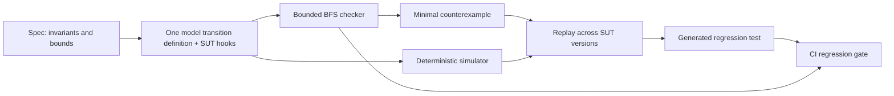

# FleetFlight

**Pre-release verification for distributed battery firmware.**
Model the system. Find a failing ordering. Replay it in CI.

A BMS, hub and inverter can each pass their own tests while their coordination fails
during a delayed message or restart. FleetFlight is being built to search every allowed
ordering within explicit bounds, save a shortest failing sequence, and replay that
sequence through the same transition code. The resulting regression belongs in the
firmware review, alongside the assumptions that made the check meaningful.

**Current checkout (`integration`):** model, checker, simulator/replay, CLI, UI and CI
automation are integrated, and `make demo` runs end to end on real code. Measured
results are in [STATUS.md](STATUS.md). `core-ref` and `firmware-ref` are reference
code we wrote, not Base firmware.

## 60-second quickstart

From the repository root, with Python 3.12+ (CI uses 3.12), Node.js/npm compatible with
the UI package, Bash and Make installed:

```sh
make setup && make demo
```

Setup creates `.venv`, installs the Python development dependencies and runs `npm ci`
in `ui/`. Press Enter between demo scenes. This is the quickstart command, not a
promise that dependency downloads or exhaustive exploration finish in 60 seconds.
Python-only contributors
can run `python3 -m venv .venv` and `.venv/bin/python -m pip install -e '.[dev]'`.

```sh
make test       # foundation/product tests and automation safety tests
make demo-fast  # same real commands, no recording pauses
make regress    # replay committed counterexamples, then generated pytest tests
make check      # full bounded check against scripts/ci_sut.txt
make ui         # build ui/dist
make serve      # build UI, serve http://127.0.0.1:8765
```

`make check SUT=v0.3.2` chooses another reference version. Defaults are 120 moves,
3 injections and a 4000 ms horizon (`DEPTH`, `INJECTIONS`, `HORIZON_MS` overrides).
One tick is **50 ms**; depth counts both ticks and injections. PASS applies only to
the specified model, assumptions and bounds. Output goes to `out/check/`; each demo
uses its own fresh `out/demo.*` directory. `make serve` serves the newest demo directory;
`bash scripts/serve.sh 8765 out/check` serves another one.

## The demo to verify

The bug is in **our reference firmware** v0.3.1: the inverter keeps discharging on
the hub's last command for 1000 ms, which is longer than the model's 500 ms shutdown
budget. The checker's shortest I1 counterexample is a BMS fault plus a hub↔inverter link
loss. A separate I2 counterexample (hub restart) shows the hub restoring an old
DISCHARGE command from NVM without a BMS report. The budget is a reference requirement,
not a measured or supplied Base safety requirement.

The scripted acceptance sequence is:

1. A BMS fault without a restart passes in simulation.
2. Checking `v0.3.1` produces an I1 counterexample, selected by its real content-hash id.
3. Explain it and replay the original failure 100 times to check determinism.
4. Replay against `v0.3.2`: the hub-only fix still fails I1.
5. Replay against `v0.3.3`: inverter fallback passes; full bounded checking also passes.
6. Generate a regression from that artifact and run `pytest tests/regress`.

Observed on 2026-09-27 (M1 Pro, single thread; details in [STATUS.md](STATUS.md)):

| Measurement | Observed result |
|---|---|
| Counterexample id and shortest path | `cex-286e0592`: `bms_fault@0`, `network_loss@0`, 10 ticks (12 moves); I1 violated at 500 ms |
| Original trace hash / repeat consistency | 13/13 steps match the checker; 100/100 replays give `sha256:b545736726cb` |
| v0.3.1 / v0.3.2 / v0.3.3 fault-to-stop windows | 1050 / 1050 / 250 ms (budget 500) |
| v0.3.1 check | 1,291,349 states, 1,844,026 transitions, 38.2 s; I1, I2, I4 FAIL |
| v0.3.3 explored states, transitions and elapsed time | 1,187,853 states, 1,728,511 transitions, 35.5 s; all PASS, worst I1 window 450 ms |

The scripts require exit 1 for the demonstrated failures and exit 0 for successes;
usage errors and missing implementations stop the demo. A passing search must also
report `stats.complete = true`. Mock and fixture data are never substituted.

## Architecture



The checker enumerates enabled moves; the simulator executes chosen moves. Both call
the model's pure `apply` function. Counterexamples contain injections with tick indices
plus a tick count. Replay continues to the horizon, comparing hashes over the original
counterexample length. Changed firmware may disable an injection: it is skipped and
reported, never forced. See the frozen [contract](CONTRACT.md).

## Built vs roadmap

| Layer | Built (on `integration`) | Roadmap |
|---|---|---|
| Shared definition | Pure hook API, deterministic hashes, schemas, contract tests; `core-ref` model with `firmware-ref` v0.3.1–v0.3.3 | Real hub code through the hooks; SIL/FFI firmware |
| Search | Bounded BFS, minimal counterexamples, cross-checked against an independent DFS oracle; `check --only` scopes the fault model | Symmetry / partial-order reduction |
| Replay | Simulator, replay across SUT versions, regression generator, CLI, localhost HTTP API | HIL scenario runs (no bit-exact replay there) |
| Demo and CI | Make targets, guarded scripts, committed regression corpus, workflow | Hosted Actions run and branch protection (needs a remote) |
| Visual evidence | Real-data UI (spec, checks, counterexample swimlane, replay, versions, regressions) | `GET /api/regress` for the generated test source |
| Real firmware / fleet | No hardware validation claimed | SIL/FFI adapters, HIL, physical systems, fleet invariants |

## Assumptions and claims

- **ASSUMED:** the discrete model, fault domains, bus timing and restart behavior
  represent the coordination behavior being investigated.
  `fleetflight describe --model core-ref --json` and every report expose the exact assumptions.
- **ASSUMED:** the reference shutdown budget is 500 ms. Production requirements must
  come from the firmware/system owner.
- **OUT OF SCOPE:** contactors, hardwired BMS trips, analog electrical dynamics and
  hardware failures outside the declared model.
- A shortest counterexample means shortest in model moves under BFS. It does not
  imply the fewest physical root causes or an unbounded safety proof.
- `core-ref` is a reference implementation we wrote. We have not found a Base Gen 3
  bug, verified Base firmware, or established that this models Base's architecture.
- `mocks/` and `fixtures/` are explicitly illustrative. Their timings, counts and
  hashes are not results and must not appear as measured evidence.

## CI and the red-to-green PR

The workflow has independent `test`, `regress` and `check` jobs. `regress` replays the
committed corpus against `scripts/ci_sut.txt`, then runs generated pytest tests.
It fails when the corpus is empty. The corpus holds `cex-286e0592` (from the real demo
run); it passes against v0.3.3 and fails if the pin is moved back to v0.3.1 or v0.3.2.
The slower `check` job publishes a Markdown summary even on an invariant failure
and uploads available counterexamples on failure.

The repository owner must mark **regress** as required in GitHub branch protection
to block merges; a workflow file alone cannot configure that. The exact local and
optional publishing steps are in [the demo PR plan](scripts/demo_pr.md).

## Prior art

[FoundationDB](https://apple.github.io/foundationdb/testing.html) uses deterministic
simulation for repeatable distributed failure tests.
[TigerBeetle](https://github.com/tigerbeetle/tigerbeetle) is another relevant deterministic
simulation project. [Jepsen](https://jepsen.io/) tests distributed-system safety.
[TLA+](https://lamport.azurewebsites.net/tla/tla.html) models concurrent systems and has
model-checking and proof tools; sharing executable transitions here reduces translation
between this checker and simulator, but does not remove model/production gaps.
[Antithesis](https://antithesis.com/product/) combines fault injection and deterministic
replay. FleetFlight's intended contribution is a small, inspectable workflow applying
these ideas to BMS/hub/inverter coordination. PLECS or other plant simulation would be
a future backend, not a capability claimed here.

## Repository layout

| Path | Purpose |
|---|---|
| `src/fleetflight/core.py`, `CONTRACT.md`, `schemas/` | Frozen API, formats and determinism rules |
| `src/fleetflight/{models,sut,check}/` | Model, reference controllers and checker streams |
| `src/fleetflight/{sim,regress,report}/`, `cli.py` | Replay, generated tests, reports and CLI stream |
| `tests/`, `tests/regress/` | Product tests and generated counterexample regressions |
| `scripts/`, `Makefile`, `.github/workflows/` | Local reproduction, recording and CI |
| `ui/` | UI stream (absent until integrated) |
| `mocks/`, `fixtures/` | Labeled design examples, never measured evidence |
| `sessions/`, `status/` | Stream instructions, progress and integration blockers |
